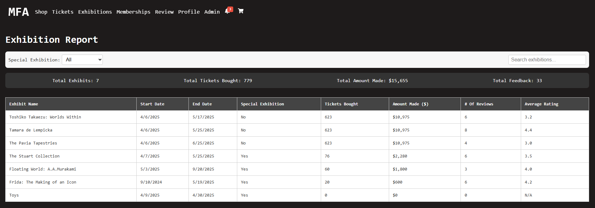
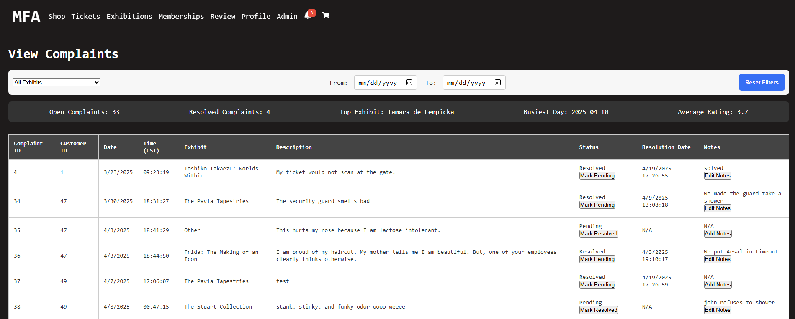
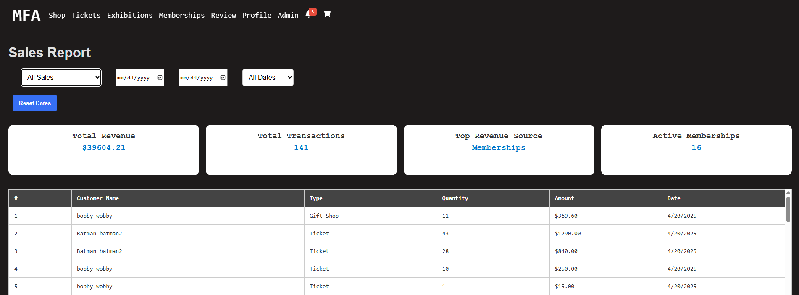

    Houston Museum Database Project
  

    A full-stack web application and database system for managing a modern museum's operations, designed to handle exhibitions, ticketing, staff, customer interactions, and analytics-driven reports.
  


---

### About the Project

Welcome to the Houston Museum Database full-stack project! This system was built to simulate a real-world museum management system through a responsive web app powered by a MySQL database and a custom Node.js backend. The frontend is built with React, Vite, and CSS.

#### Mini-World Description:
Our mini-world revolves around two major components:

- **Users**: Customers, managers, curators, and admins each have role-specific access to the platform. The system supports registration, login, profile management, ticket purchasing, membership purchasing, giftshop purchasing, and complaints submission.
- **Museum Operations**: The database manages exhibitions, ticket sales, customer feedback, and staff records. Admins and managers are empowered with reports to make data-driven decisions.

#### Key Relationships:
- **Admins & Managers**: Handle ticket sales, employee oversight, complaint resolution, and reporting.
- **Manager**: Oversees each departments’ staff, staff performance, overall reviews, and gift shop maintenance.
- **Curator**: Focuses on managing museum content, especially exhibitions and the artwork collections within each exhibition.
- **Customers**: Register to buy tickets, leave feedback, and interact with the museum.
- **Exhibitions**: Organized and tracked with metadata, ticketing status, and linked complaints. Also has unique artworks within each exhibition.

---

## Run Locally

### Requirements

- Node.js and npm installed

### 1. Clone the Repository

```bash
git clone https://github.com/ArsalJafri/MuseumDB.git

### 2. Navigate to the Frontend Folder
cd MuseumDB/client

###3. Install Dependencies
npm install

###4. Start the React App
npm start

##5. Open the App
Visit: http://localhost:3000

##6. Log In Using Demo Credentials


---

# Project Requirements

1. [**User Authentication for different user roles**](#user-auth)
2. [**Data entry forms to add, edit, or deactivate records**](#data-entry-forms)
3. [**At least 2 Triggers**](#triggers)
4. [**At least 3 Queries**](#queries)
5. [**At least 3 Reports**](#reports)

---

# Technologies

**Frontend**: React, Vite, CSS, Framer Motion  
**Backend**: Node.js (native http module only)  
**Database**: MySQL on Azure  
**Authentication**: JWT (httpOnly cookies)  
**Hosting**: Vercel (frontend), Render/Azure (backend)  

---

## User Authentication for Different User Roles

- **Customer**: Can register, purchase tickets, view exhibits, and submit complaints.
- **Manager**: Oversees each departments’ staff, staff performance, overall reviews, and gift shop maintenance.
- **Curator**: Focuses on managing museum content, especially exhibitions and the artwork collections within each exhibition.
- **Admin**: Represents highest-level museum personnel overseeing operations across all the departments and roles.

---

## Data Entry Forms

### Public:
- Sign Up / Login / Edit Profile / Change Password: Users can register for an account by providing their personal and contact information. Once logged in, they can update their profile details (like name, phone number, and birthday), and securely change their password. These forms ensure user identity and give customers control over their account information.
- Submit Complaint Form: Logged-in users can submit complaints or feedback about their museum experience, selecting an exhibit, providing a message, and optionally rating it. This form sends the complaint to the database, where it can be reviewed and resolved by staff or admins. It helps improve visitor satisfaction by enabling a structured way to express concerns.
- Purchase Tickets: Customers can browse active exhibitions and purchase tickets by selecting quantity and ticket type. Each transaction generates a new record in the ticketing and purchase system, contributing to sales reports and exhibition analytics. This form allows users to directly engage with the museum's offerings.
- Buy Memberships: Users can choose from different membership tiers (e.g., Regular, Member, Executive) and purchase a membership for added perks. This creates a membership record in the database and links it to their customer account. Membership purchases are included in the sales report and affect access privileges across the site.
- Update Membership Type
Depending on system setup, users may be allowed to update membership type on the Memberships page.
- Purchase Gift Shop Items: Logged-in users can browse gift shop items, add them to a virtual cart, and proceed to checkout. Each completed transaction is stored in the purchase history and affects product inventory. This form allows customers to buy merchandise while contributing to sales analytics and inventory tracking.

### Admin/Manager/Curator:
- Manage Employees: This entry form allows the admin to add new employees, or deactivate employees. This form allows the admin to filter by all, active, or inactive.
- Manage Exhibitions: This entry form allows only the admin and curator to add new exhibitions, edit exhibits, and either activate or deactivate exhibits.
- Manage Artworks: This entry form allows only admin and curator to add new artworks to specific exhibitions, remove artworks, and edit artworks. This form allows the admin/curator to filter artworks by specific exhibitions.
- Manage Giftshop: This entry form allows only the admin and manager to add new products, remove products, and restock products. This form also allows the admin or manager to filter by category type.
- Manage Tickets: This entry form allows only the admin to add new ticket types, edit tickets, and either activate or deactivate tickets.

---

## Triggers

### 1. Complaint Notification:
- Trigger is located in the complaints table.
- It inserts a message into the notifications table whenever a new complaint is submitted with a rating of 2 stars or lower.
- This alert is intended to notify admins for potential follow-up or resolution.
- Purpose: Helps maintain customer satisfaction by ensuring poor experiences are flagged automatically.
- The following is the trigger code:
```sql
CREATE DEFINER=`dbadmin`@`%` TRIGGER `trg_low_rating_complaint`
AFTER INSERT ON `complaints`
FOR EACH ROW
BEGIN
    DECLARE customerName VARCHAR(100);

    -- Get the customer's full name from the customers table
    SELECT CONCAT(First_Name, ' ', Last_Name)
    INTO customerName
    FROM customers
    WHERE customer_ID = NEW.customer_ID;

    IF NEW.Complaint_Rating <= 2 THEN
        INSERT INTO notifications (message, created_at, status)
        VALUES (
            CONCAT(
                'Complaint ID ', NEW.Complaint_ID,
                ' by Customer ', customerName,
                ' received a low rating of ', NEW.Complaint_Rating,
                '. Action required.'
            ),
            NOW(),
            'unread'
        );
    END IF;
END;
```

### 2. Low Stock Notification:
When a complaint is logged, the system generates a manager notification suggesting an employee to handle it.
- Trigger is located in the products table and activates after an item is updated, typically after a gift shop purchase.
- If an item's stock was previously 5 or more, but is updated to a value below 5, the trigger is activated.
- It inserts a low stock warning into the notifications table.
- The frontend system reads these messages and alerts staff or management accordingly.
- Semantic Constraint: Enforces a business rule to always generate alerts when inventory is critically low, preventing stockouts and ensuring smooth gift shop operations.
- The following is the trigger code:
```sql
CREATE DEFINER=`dbadmin`@`%` TRIGGER `notify_low_stock`
AFTER UPDATE ON `products`
FOR EACH ROW
BEGIN
    IF NEW.Stock_Quantity < 5 AND OLD.Stock_Quantity >= 5 THEN
        INSERT INTO notifications (message, created_at, status)
        VALUES (
            CONCAT('Stock low for "', NEW.Name, '"'),
            NOW(),
            'unread'
        );
    END IF;
END;
```

---

## Queries

### 1. Complaints Summary Query:
- This query was built to generate a comprehensive complaints report using data from the complaints and customers tables. It allows admins and managers to view all submitted complaints, track their status (pending or resolved), identify trends in complaint types, and monitor feedback patterns over time. By aggregating data such as total open and resolved complaints, most frequently reported exhibit, busiest complaint day, and average rating, the report helps the museum address recurring issues, improve visitor experience, and ensure accountability through structured resolution workflows.

```sql
SELECT
  (SELECT COUNT(*) FROM complaints WHERE Status = 'Pending') AS open_complaints,
  (SELECT COUNT(*) FROM complaints WHERE Status = 'Resolved') AS resolved_complaints,
  (SELECT Complaint_Type FROM complaints GROUP BY Complaint_Type ORDER BY COUNT(*) DESC LIMIT 1) AS top_complaint_type,
  (SELECT DATE(Complaint_Date) FROM complaints GROUP BY DATE(Complaint_Date) ORDER BY COUNT(*) DESC LIMIT 1) AS busiest_day,
  (SELECT AVG(Complaint_Rating) FROM complaints WHERE Complaint_Rating IS NOT NULL) AS avg_rating;
```

### 2. Exhibition Report Query
- These queries were built to generate detailed reports for exhibitions. The first query pulls data from the exhibitions and complaints tables to show how many complaints each active exhibit has received and what their average ratings are, helping admins assess visitor satisfaction. The second query aggregates ticket purchases and revenue from the tickets and purchase_tickets tables, allowing admins to see how much money was made and how many tickets were sold for each exhibit—separating results for special ticketed exhibitions versus regular free ones.
```sql

SELECT e., 
       COUNT(c.Complaint_ID) AS complaintCount, 
       AVG(c.Complaint_Rating) AS averageReview 
FROM exhibitions e 
LEFT JOIN complaints c ON c.Complaint_Type = e.Name 
WHERE e.is_active = TRUE 
GROUP BY e.Exhibition_ID;
```

```sql
SELECT 
  e.Exhibition_ID,
  CASE 
    WHEN e.requires_ticket THEN COALESCE(agg.Tickets_Bought, 0)
    ELSE COALESCE(regular.Tickets_Bought, 0)
  END AS Tickets_Bought,
  CASE 
    WHEN e.requires_ticket THEN COALESCE(agg.Amount_Made, 0)
    ELSE COALESCE(regular.Amount_Made, 0)
  END AS Amount_Made
FROM exhibitions e
LEFT JOIN (
  SELECT 
    t.Exhibition_ID,
    SUM(pt.Quantity) AS Tickets_Bought,
    SUM(pt.Quantity * pt.Price) AS Amount_Made
  FROM purchase_tickets pt
  JOIN tickets t ON pt.Ticket_ID = t.Ticket_ID
  GROUP BY t.Exhibition_ID
) agg ON e.Exhibition_ID = agg.Exhibition_ID
CROSS JOIN (
  SELECT 
    SUM(pt.Quantity) AS Tickets_Bought,
    SUM(pt.Quantity * pt.Price) AS Amount_Made
  FROM purchase_tickets pt
  JOIN tickets t ON pt.Ticket_ID = t.Ticket_ID
  WHERE t.Exhibition_ID IS NULL
) regular
WHERE e.is_active = TRUE;
```

### 3. Ticket Sales Aggregation Query
Tickets only 
This query will give a summary when the admin chooses to filter the sales report as tickets only.
It joins purchase_tickets, purchases and  customers tables.

purchase_tickets – holds ticket-specific sale details
purchases – links ticket sales to customers and purchase dates
customers – provides customer name inform

 SELECT
            CONCAT(pt.Purchase_ID, '-', pt.Ticket_ID) AS Sale_ID,
            CONCAT(c.First_Name, ' ', c.Last_Name) AS Customer_Name,
            'Ticket' AS Sale_Type,
            pt.Quantity * pt.Price AS Amount,
            pt.Quantity AS Quantity,
            p.Date_Purchased AS Sale_Date,
            NULL AS Product_Names
        FROM purchase_tickets pt
        JOIN purchases p ON pt.Purchase_ID = p.Purchase_ID
        JOIN customers c ON p.Customer_ID = c.Customer_ID
        ${ticketDateFilter}


---

## Reports

### Exhibition Report:
Summarizes active exhibitions, showing:
- Exhibit Name, Dates, Ticketing Requirement
- Tickets Bought, Revenue Generated
- Number of Complaints, Average Review Rating
- Filters by name or type (special vs. regular)
- Aggregates: Total Exhibits, Total Tickets, Total Revenue, Total Feedback


### Complaints/Reviews Report:
Admin/Manager dashboard for complaint handling:
- Filters by complaint type (exhibit) and date range
- Editable notes and toggle status (Resolved/Pending)
- Summary cards: Open, Resolved, Top Type, Busiest Day, Avg. Rating


### Sales Report:
- Aggregates purchase data across exhibits
- Shows top-earning exhibitions and ticket volumes

Admin can view filtered and total sales reports for:
- Tickets
- Gift Shop
- Memberships

Includes summaries like:
- Top-selling product
- Top revenue source
- Most active customer
- Most popular membership type




--------------------------------------------------
Hosted Weblink Information:

GitHub Repository: https://github.com/ArsalJafri/MuseumDB
Live Website: https://museum-db-kappa.vercel.app/

